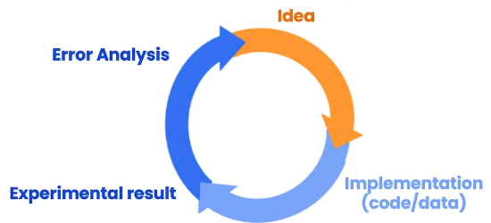
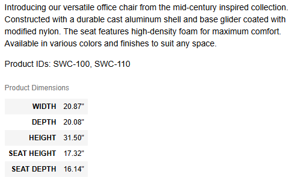
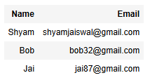
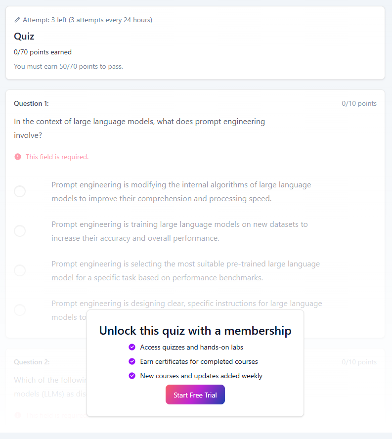
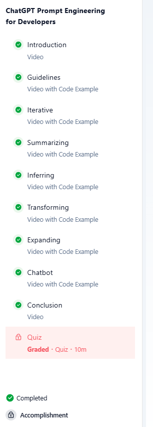

# ChatGPT Prompt Engineering for Developers

# Introduction

Course focuses on best practice for instruction-tuned LLMs.

Think of giving instructions as if you're talking to someone smart, but someone who may not properly understand your instructions. Tone is important. Specify any additional context required.

# Guidelines

## Principles

### Clear and Specific

Express what you want a model to do by being as clear and specific as possible. Longer prompts often provide more clarity and detail.

Use delimiters to clearly indicate distinct parts of input.

Delimiters assist in reducing prompt injections; when a user is allowed to enter some text into the prompt.

```py
text = f"""
You should express what you want a model to do by \ 
providing instructions that are as clear and \ 
specific as you can possibly make them. \ 
This will guide the model towards the desired output, \ 
and reduce the chances of receiving irrelevant \ 
or incorrect responses. Don't confuse writing a \ 
clear prompt with writing a short prompt. \ 
In many cases, longer prompts provide more clarity \ 
and context for the model, which can lead to \ 
more detailed and relevant outputs.
"""
prompt = f"""
Summarize the text delimited by triple backticks \ 
into a single sentence.
```{text}```
"""
response = get_completion(prompt)
print(response)
```

```
It is important to provide clear and specific instructions to guide a model towards the desired output and reduce the chances of receiving irrelevant or incorrect responses, even if it means writing a longer prompt for more clarity and context.
```

Ask for structured output.

```py
prompt = f"""
Generate a list of three made-up book titles along \ 
with their authors and genres. 
Provide them in JSON format with the following keys: 
book_id, title, author, genre.
"""
response = get_completion(prompt)
print(response)
```

```
[
    {
        "book_id": 1,
        "title": "The Midnight Garden",
        "author": "Elena Rivers",
        "genre": "Fantasy"
    },
    {
        "book_id": 2,
        "title": "Echoes of the Past",
        "author": "Nathan Black",
        "genre": "Mystery"
    },
    {
        "book_id": 3,
        "title": "Whispers in the Wind",
        "author": "Samantha Reed",
        "genre": "Romance"
    }
]
```

Check whether conditions are satisfied.

If the model makes assumptions that aren't satisfied first, if they are not satisfied then indicate this and stop short of a full task completion event.

```py
text_1 = f"""
Making a cup of tea is easy! First, you need to get some \ 
water boiling. While that's happening, \ 
grab a cup and put a tea bag in it. Once the water is \ 
hot enough, just pour it over the tea bag. \ 
Let it sit for a bit so the tea can steep. After a \ 
few minutes, take out the tea bag. If you \ 
like, you can add some sugar or milk to taste. \ 
And that's it! You've got yourself a delicious \ 
cup of tea to enjoy.
"""
prompt = f"""
You will be provided with text delimited by triple quotes. 
If it contains a sequence of instructions, \ 
re-write those instructions in the following format:

Step 1 - ...
Step 2 - …
…
Step N - …

If the text does not contain a sequence of instructions, \ 
then simply write \"No steps provided.\"

\"\"\"{text_1}\"\"\"
"""
response = get_completion(prompt)
print("Completion for Text 1:")
print(response)
```

```
Completion for Text 1:
Step 1 - Get some water boiling.
Step 2 - Grab a cup and put a tea bag in it.
Step 3 - Pour the hot water over the tea bag.
Step 4 - Let the tea steep for a few minutes.
Step 5 - Remove the tea bag.
Step 6 - Add sugar or milk to taste.
Step 7 - Enjoy your delicious cup of tea.
```

Versus an example with no instructions:

```py
text_2 = f"""
The sun is shining brightly today, and the birds are \
singing. It's a beautiful day to go for a \ 
walk in the park. The flowers are blooming, and the \ 
trees are swaying gently in the breeze. People \ 
are out and about, enjoying the lovely weather. \ 
Some are having picnics, while others are playing \ 
games or simply relaxing on the grass. It's a \ 
perfect day to spend time outdoors and appreciate the \ 
beauty of nature.
"""
prompt = f"""
You will be provided with text delimited by triple quotes. 
If it contains a sequence of instructions, \ 
re-write those instructions in the following format:

Step 1 - ...
Step 2 - …
…
Step N - …

If the text does not contain a sequence of instructions, \ 
then simply write \"No steps provided.\"

\"\"\"{text_2}\"\"\"
"""
response = get_completion(prompt)
print("Completion for Text 2:")
print(response)
```

```
Completion for Text 2:
No steps provided.
```

Few-shot prompting.

Provide successful examples of the task being performed, before asking the model to do the task.

```py
prompt = f"""
Your task is to answer in a consistent style.

<child>: Teach me about patience.

<grandparent>: The river that carves the deepest \ 
valley flows from a modest spring; the \ 
grandest symphony originates from a single note; \ 
the most intricate tapestry begins with a solitary thread.

<child>: Teach me about resilience.
"""
response = get_completion(prompt)
print(response)
```

```
<grandparent>: The tallest trees weather the strongest storms; the brightest stars shine in the darkest nights; the strongest hearts endure the greatest trials.
```

### Give Model Time to Think

If you give a model a task that is too complex, it may make up a slightly incorrect guess. In these situations, instruct the model to think longer about the problem.

Specify steps required to complete a task.

```py
text = f"""
In a charming village, siblings Jack and Jill set out on \ 
a quest to fetch water from a hilltop \ 
well. As they climbed, singing joyfully, misfortune \ 
struck—Jack tripped on a stone and tumbled \ 
down the hill, with Jill following suit. \ 
Though slightly battered, the pair returned home to \ 
comforting embraces. Despite the mishap, \ 
their adventurous spirits remained undimmed, and they \ 
continued exploring with delight.
"""
# example 1
prompt_1 = f"""
Perform the following actions: 
1 - Summarize the following text delimited by triple \
backticks with 1 sentence.
2 - Translate the summary into French.
3 - List each name in the French summary.
4 - Output a json object that contains the following \
keys: french_summary, num_names.

Separate your answers with line breaks.

Text:
```{text}```
"""
response = get_completion(prompt_1)
print("Completion for prompt 1:")
print(response)
```

```
Completion for prompt 1:
1 - Jack and Jill, siblings, go on a quest to fetch water from a hilltop well, but encounter misfortune along the way.

2 - Jack et Jill, frère et sœur, partent en quête d'eau d'un puits au sommet d'une colline, mais rencontrent des malheurs en chemin.

3 - Jack, Jill

4 - 
{
  "french_summary": "Jack et Jill, frère et sœur, partent en quête d'eau d'un puits au sommet d'une colline, mais rencontrent des malheurs en chemin.",
  "num_names": 2
}
```

Ask for output in a specified format:

```py
prompt_2 = f"""
Your task is to perform the following actions: 
1 - Summarize the following text delimited by 
  <> with 1 sentence.
2 - Translate the summary into French.
3 - List each name in the French summary.
4 - Output a json object that contains the 
  following keys: french_summary, num_names.

Use the following format:
Text: <text to summarize>
Summary: <summary>
Translation: <summary translation>
Names: <list of names in summary>
Output JSON: <json with summary and num_names>

Text: <{text}>
"""
response = get_completion(prompt_2)
print("\nCompletion for prompt 2:")
print(response)
```

```
Completion for prompt 2:
Summary: Jack and Jill, siblings, go on a quest to fetch water from a hilltop well, but encounter misfortune along the way.

Translation: Jack et Jill, frère et sœur, partent en quête d'eau d'un puits au sommet d'une colline, mais rencontrent des malheurs en chemin.

Names: Jack, Jill

Output JSON: 
{
  "french_summary": "Jack et Jill, frère et sœur, partent en quête d'eau d'un puits au sommet d'une colline, mais rencontrent des malheurs en chemin.",
  "num_names": 2
}
```

Instruct the model to work out its own solution before rushing to a conclusion.

Explicitly instruct the model to reason out a solution.

```py
prompt = f"""
Determine if the student's solution is correct or not.

Question:
I'm building a solar power installation and I need \
 help working out the financials. 
- Land costs $100 / square foot
- I can buy solar panels for $250 / square foot
- I negotiated a contract for maintenance that will cost \ 
me a flat $100k per year, and an additional $10 / square \
foot
What is the total cost for the first year of operations 
as a function of the number of square feet.

Student's Solution:
Let x be the size of the installation in square feet.
Costs:
1. Land cost: 100x
2. Solar panel cost: 250x
3. Maintenance cost: 100,000 + 100x
Total cost: 100x + 250x + 100,000 + 100x = 450x + 100,000
"""
response = get_completion(prompt)
print(response)
```

```
The student's solution is correct. The total cost for the first year of operations as a function of the number of square feet is indeed 450x + 100,000.
```

This is incorrect. We can fix this by instructing the model to work out its own solution.

````py
prompt = f"""
Your task is to determine if the student's solution \
is correct or not.
To solve the problem do the following:
- First, work out your own solution to the problem including the final total. 
- Then compare your solution to the student's solution \ 
and evaluate if the student's solution is correct or not. 
Don't decide if the student's solution is correct until 
you have done the problem yourself.

Use the following format:
Question:
```
question here
```
Student's solution:
```
student's solution here
```
Actual solution:
```
steps to work out the solution and your solution here
```
Is the student's solution the same as actual solution \
just calculated:
```
yes or no
```
Student grade:
```
correct or incorrect
```

Question:
```
I'm building a solar power installation and I need help \
working out the financials. 
- Land costs $100 / square foot
- I can buy solar panels for $250 / square foot
- I negotiated a contract for maintenance that will cost \
me a flat $100k per year, and an additional $10 / square \
foot
What is the total cost for the first year of operations \
as a function of the number of square feet.
``` 
Student's solution:
```
Let x be the size of the installation in square feet.
Costs:
1. Land cost: 100x
2. Solar panel cost: 250x
3. Maintenance cost: 100,000 + 100x
Total cost: 100x + 250x + 100,000 + 100x = 450x + 100,000
```
Actual solution:
"""
response = get_completion(prompt)
print(response)
````

````
Let x be the size of the installation in square feet.

Costs:
1. Land cost: $100 * x
2. Solar panel cost: $250 * x
3. Maintenance cost: $100,000 + $10 * x

Total cost: $100 * x + $250 * x + $100,000 + $10 * x = $360 * x + $100,000
```
The total cost for the first year of operations as a function of the number of square feet is $360 * x + $100,000.
```
Is the student's solution the same as actual solution just calculated:
```
Yes
```
Student grade:
```
correct
```
````

IN THIS CASE THE MODEL ACTUALLY FAILED. IN THE DEMO VIDEO THIS FUNCTIONED AND THE MODEL PROPERLY GRADED THE STUDENT AS INCORRECT, BUT FOR ME IT WOULD NOT.

# Model Limitations

## Hallucinations

The model does not know the boundary of its knowledge very well.

```py
prompt = f"""
Tell me about AeroGlide UltraSlim Smart Toothbrush by Boie
"""
response = get_completion(prompt)
print(response)
```

```
The AeroGlide UltraSlim Smart Toothbrush by Boie is a high-tech toothbrush designed to provide a superior cleaning experience. It features ultra-soft bristles that are gentle on the gums and teeth, while still effectively removing plaque and debris. The toothbrush also has a slim design that makes it easy to maneuver and reach all areas of the mouth... etc.
```

To reduce hallucinations, you can ask the model to first find relevant quotes from text, then use those quotes to answer questions - this provides a way to trace answers back to a source.

# Iterative Prompt Development



## Prompt Guidelines

- Be clear and specific
- Analyse why result does not give desired output
- Refine the idea and the prompt
- Repeat

```py
fact_sheet_chair = """
OVERVIEW
- Part of a beautiful family of mid-century inspired office furniture, 
including filing cabinets, desks, bookcases, meeting tables, and more.
- Several options of shell color and base finishes.
- Available with plastic back and front upholstery (SWC-100) 
or full upholstery (SWC-110) in 10 fabric and 6 leather options.
- Base finish options are: stainless steel, matte black, 
gloss white, or chrome.
- Chair is available with or without armrests.
- Suitable for home or business settings.
- Qualified for contract use.

CONSTRUCTION
- 5-wheel plastic coated aluminum base.
- Pneumatic chair adjust for easy raise/lower action.

DIMENSIONS
- WIDTH 53 CM | 20.87”
- DEPTH 51 CM | 20.08”
- HEIGHT 80 CM | 31.50”
- SEAT HEIGHT 44 CM | 17.32”
- SEAT DEPTH 41 CM | 16.14”

OPTIONS
- Soft or hard-floor caster options.
- Two choices of seat foam densities: 
 medium (1.8 lb/ft3) or high (2.8 lb/ft3)
- Armless or 8 position PU armrests 

MATERIALS
SHELL BASE GLIDER
- Cast Aluminum with modified nylon PA6/PA66 coating.
- Shell thickness: 10 mm.
SEAT
- HD36 foam

COUNTRY OF ORIGIN
- Italy
"""
```

```py
prompt = f"""
Your task is to help a marketing team create a 
description for a retail website of a product based 
on a technical fact sheet.

Write a product description based on the information 
provided in the technical specifications delimited by 
triple backticks.

Technical specifications: ```{fact_sheet_chair}```
"""
response = get_completion(prompt)
print(response)
```

```
Introducing our stylish and versatile mid-century inspired office chair, perfect for both home and business settings. This chair is part of a beautiful family of office furniture that includes filing cabinets, desks, bookcases, meeting tables, and more.

Customize your chair with several options of shell color and base finishes to suit your personal style. Choose between plastic back and front upholstery or full upholstery in a variety of fabric and leather options. The base finish options include stainless steel, matte black, gloss white, or chrome. You can also choose to have armrests or go for a sleek armless design.

Constructed with a 5-wheel plastic coated aluminum base, this chair features a pneumatic chair adjust for easy raise/lower action. The dimensions of the chair are as follows: width 53 cm, depth 51 cm, height 80 cm, seat height 44 cm, and seat depth 41 cm.

Personalize your chair even further with options such as soft or hard-floor caster options, two choices of seat foam densities (medium or high), and the choice between armless or 8 position PU armrests.

Made with high-quality materials, including a cast aluminum shell with modified nylon coating and HD36 foam seat, this chair is designed for durability and comfort. Plus, it is qualified for contract use, making it a reliable choice for any workspace.

Add a touch of Italian elegance to your office with this stylish and functional office chair. Elevate your workspace with our mid-century inspired chair that combines style, comfort, and functionality seamlessly.
```

Notice that the result is very large.

```py
prompt = f"""
Your task is to help a marketing team create a 
description for a retail website of a product based 
on a technical fact sheet.

Write a product description based on the information 
provided in the technical specifications delimited by 
triple backticks.

Use at most 50 words.

Technical specifications: ```{fact_sheet_chair}```
"""
response = get_completion(prompt)
print(response)
```

```
Introducing our versatile and stylish mid-century office chair, available in a range of colors and finishes. With adjustable height and comfortable upholstery options, this chair is perfect for both home and business use. Made in Italy with quality materials, it's a perfect blend of form and function.
```

```py
len(response.split()) # 47
```

There are various ways to try control the length output from an LLM. Such as "50 words", "3 sentences", "280 characters", etc.

```py
prompt = f"""
Your task is to help a marketing team create a 
description for a retail website of a product based 
on a technical fact sheet.

Write a product description based on the information 
provided in the technical specifications delimited by 
triple backticks.

The description is intended for furniture retailers, 
so should be technical in nature and focus on the 
materials the product is constructed from.

At the end of the description, include every 7-character 
Product ID in the technical specification.

Use at most 50 words.

Technical specifications: ```{fact_sheet_chair}```
"""
response = get_completion(prompt)
print(response)
```

```
Introducing our versatile and stylish office chair, part of a mid-century inspired furniture collection. Choose from a variety of shell colors and base finishes to suit your space. Constructed with a durable aluminum base and high-density foam seat for comfort. Perfect for home or business use. 

Product IDs: SWC-100, SWC-110
```

You can also ask the model to specifically extract information and organise it into a table.

```py
prompt = f"""
Your task is to help a marketing team create a 
description for a retail website of a product based 
on a technical fact sheet.

Write a product description based on the information 
provided in the technical specifications delimited by 
triple backticks.

The description is intended for furniture retailers, 
so should be technical in nature and focus on the 
materials the product is constructed from.

At the end of the description, include every 7-character 
Product ID in the technical specification.

After the description, include a table that gives the 
product's dimensions. The table should have two columns.
In the first column include the name of the dimension. 
In the second column include the measurements in inches only.

Give the table the title 'Product Dimensions'.

Format everything as HTML that can be used in a website. 
Place the description in a <div> element.

Use at most 50 words.

Technical specifications: ```{fact_sheet_chair}```
"""

response = get_completion(prompt)
print(response)
```

```
<div>
<p>Introducing our versatile office chair from the mid-century inspired collection. Constructed with a durable cast aluminum shell and base glider coated with modified nylon. The seat features high-density foam for maximum comfort. Available in various colors and finishes to suit any space.</p>
<p>Product IDs: SWC-100, SWC-110</p>
</div>

<table>
  <caption>Product Dimensions</caption>
  <tr>
    <th>WIDTH</th>
    <td>20.87"</td>
  </tr>
  <tr>
    <th>DEPTH</th>
    <td>20.08"</td>
  </tr>
  <tr>
    <th>HEIGHT</th>
    <td>31.50"</td>
  </tr>
  <tr>
    <th>SEAT HEIGHT</th>
    <td>17.32"</td>
  </tr>
  <tr>
    <th>SEAT DEPTH</th>
    <td>16.14"</td>
  </tr>
</table>
```



Often it's not about being the best prompt engineer, it's about having a good workflow to iteratively design your prompts.

# Summarising

Summarising can be used to read more text than you previously could, such as reading an entire article quickly in only a few minutes.

```py
prod_review = """
Got this panda plush toy for my daughter's birthday, \
who loves it and takes it everywhere. It's soft and \ 
super cute, and its face has a friendly look. It's \ 
a bit small for what I paid though. I think there \ 
might be other options that are bigger for the \ 
same price. It arrived a day earlier than expected, \ 
so I got to play with it myself before I gave it \ 
to her.
"""
```

```py
prompt = f"""
Your task is to generate a short summary of a product \
review from an ecommerce site. 

Summarize the review below, delimited by triple 
backticks, in at most 30 words. 

Review: ```{prod_review}```
"""

response = get_completion(prompt)
print(response)
```

```
Soft, cute panda plush toy loved by daughter, but smaller than expected for the price. Arrived early, friendly face.
```

You can modify the summary prompt to be more focused toward a certain group of people - such as designing the summary for the shipping department, or pricing department.

```py
prompt = f"""
Your task is to generate a short summary of a product \
review from an ecommerce site to give feedback to the \
Shipping deparmtment. 

Summarize the review below, delimited by triple 
backticks, in at most 30 words, and focusing on any aspects \
that mention shipping and delivery of the product. 

Review: ```{prod_review}```
"""

response = get_completion(prompt)
print(response)
```

```
The customer was pleased with the early delivery of the panda plush toy, but felt it was slightly small for the price paid.
```

Sometimes a summary may include information that may not be helpful. By rewording your prompt to use "extract" instead of "summarise" you may see better results...

```py
prompt = f"""
Your task is to extract relevant information from \ 
a product review from an ecommerce site to give \
feedback to the Shipping department. 

From the review below, delimited by triple quotes \
extract the information relevant to shipping and \ 
delivery. Limit to 30 words. 

Review: ```{prod_review}```
"""

response = get_completion(prompt)
print(response)
```

```
Feedback: The product arrived a day earlier than expected, allowing the customer to play with it before giving it as a gift.
```

You can summarise multiple pieces of text easily like so:

```py

review_1 = prod_review 

# review for a standing lamp
review_2 = """
Needed a nice lamp for my bedroom, and this one \
had additional storage and not too high of a price \
point. Got it fast - arrived in 2 days. The string \
to the lamp broke during the transit and the company \
happily sent over a new one. Came within a few days \
as well. It was easy to put together. Then I had a \
missing part, so I contacted their support and they \
very quickly got me the missing piece! Seems to me \
to be a great company that cares about their customers \
and products. 
"""

# review for an electric toothbrush
review_3 = """
My dental hygienist recommended an electric toothbrush, \
which is why I got this. The battery life seems to be \
pretty impressive so far. After initial charging and \
leaving the charger plugged in for the first week to \
condition the battery, I've unplugged the charger and \
been using it for twice daily brushing for the last \
3 weeks all on the same charge. But the toothbrush head \
is too small. I’ve seen baby toothbrushes bigger than \
this one. I wish the head was bigger with different \
length bristles to get between teeth better because \
this one doesn’t.  Overall if you can get this one \
around the $50 mark, it's a good deal. The manufactuer's \
replacements heads are pretty expensive, but you can \
get generic ones that're more reasonably priced. This \
toothbrush makes me feel like I've been to the dentist \
every day. My teeth feel sparkly clean! 
"""

# review for a blender
review_4 = """
So, they still had the 17 piece system on seasonal \
sale for around $49 in the month of November, about \
half off, but for some reason (call it price gouging) \
around the second week of December the prices all went \
up to about anywhere from between $70-$89 for the same \
system. And the 11 piece system went up around $10 or \
so in price also from the earlier sale price of $29. \
So it looks okay, but if you look at the base, the part \
where the blade locks into place doesn’t look as good \
as in previous editions from a few years ago, but I \
plan to be very gentle with it (example, I crush \
very hard items like beans, ice, rice, etc. in the \ 
blender first then pulverize them in the serving size \
I want in the blender then switch to the whipping \
blade for a finer flour, and use the cross cutting blade \
first when making smoothies, then use the flat blade \
if I need them finer/less pulpy). Special tip when making \
smoothies, finely cut and freeze the fruits and \
vegetables (if using spinach-lightly stew soften the \ 
spinach then freeze until ready for use-and if making \
sorbet, use a small to medium sized food processor) \ 
that you plan to use that way you can avoid adding so \
much ice if at all-when making your smoothie. \
After about a year, the motor was making a funny noise. \
I called customer service but the warranty expired \
already, so I had to buy another one. FYI: The overall \
quality has gone done in these types of products, so \
they are kind of counting on brand recognition and \
consumer loyalty to maintain sales. Got it in about \
two days.
"""

reviews = [review_1, review_2, review_3, review_4]
```

```py
for i in range(len(reviews)):
    prompt = f"""
    Your task is to generate a short summary of a product \ 
    review from an ecommerce site. 

    Summarize the review below, delimited by triple \
    backticks in at most 20 words. 

    Review: ```{reviews[i]}```
    """

    response = get_completion(prompt)
    print(i, response, "\n")
```

```
0 Soft, cute panda plush loved by daughter, but small for price. Arrived early, friendly face. 

1 Great lamp with storage, fast delivery, excellent customer service for missing parts. Company cares about customers. 

2 Impressive battery life, small brush head, good deal for $50, generic replacement heads available, leaves teeth feeling clean. 

3 17-piece system on sale for $49, quality decline, motor issue after a year, price increase, customer service, brand loyalty. 
```

# Inferring

Useful for performing some kind of analysis, such as extracting labels, names, sentiment, etc. In traditional ML workflows, you needed to collect a label dataset, train your model, and figure out where to deploy the model. For each separate task you had to train and deploy a separate model. Whereas an LLM can be used to do all of this.

```py
lamp_review = """
Needed a nice lamp for my bedroom, and this one had \
additional storage and not too high of a price point. \
Got it fast.  The string to our lamp broke during the \
transit and the company happily sent over a new one. \
Came within a few days as well. It was easy to put \
together.  I had a missing part, so I contacted their \
support and they very quickly got me the missing piece! \
Lumina seems to me to be a great company that cares \
about their customers and products!!
"""
```

```py
prompt = f"""
What is the sentiment of the following product review, 
which is delimited with triple backticks?

Review text: '''{lamp_review}'''
"""
response = get_completion(prompt)
print(response)
```

```
The sentiment of the review is positive. The reviewer is satisfied with the lamp, the customer service, and the company in general.
```

If you wanted a more concise response for post-processing, you can use a prompt like this:

```py
prompt = f"""
What is the sentiment of the following product review, 
which is delimited with triple backticks?

Give your answer as a single word, either "positive" \
or "negative".

Review text: '''{lamp_review}'''
"""
response = get_completion(prompt)
print(response)
```

```
Positive
```

```py
prompt = f"""
Identify a list of emotions that the writer of the \
following review is expressing. Include no more than \
five items in the list. Format your answer as a list of \
lower-case words separated by commas.

Review text: '''{lamp_review}'''
"""
response = get_completion(prompt)
print(response)
```

```
happy, satisfied, grateful, impressed, pleased
```

```py
prompt = f"""
Is the writer of the following review expressing anger?\
The review is delimited with triple backticks. \
Give your answer as either yes or no.

Review text: '''{lamp_review}'''
"""
response = get_completion(prompt)
print(response)
```

```
No
```

With supervised learning, if you wanted to build all of these inference prompts with classification models, it could take weeks, but with LLMs we can do them all with the same model.

Extracting product and company name from customer review:

```py
prompt = f"""
Identify the following items from the review text: 
- Item purchased by reviewer
- Company that made the item

The review is delimited with triple backticks. \
Format your response as a JSON object with \
"Item" and "Brand" as the keys. 
If the information isn't present, use "unknown" \
as the value.
Make your response as short as possible.
  
Review text: '''{lamp_review}'''
"""
response = get_completion(prompt)
print(response)
```

```
{
  "Item": "lamp",
  "Brand": "Lumina"
}
```

You can actually extract multiple items from a review, at once, like so:

```py
prompt = f"""
Identify the following items from the review text: 
- Sentiment (positive or negative)
- Is the reviewer expressing anger? (true or false)
- Item purchased by reviewer
- Company that made the item

The review is delimited with triple backticks. \
Format your response as a JSON object with \
"Sentiment", "Anger", "Item" and "Brand" as the keys.
If the information isn't present, use "unknown" \
as the value.
Make your response as short as possible.
Format the Anger value as a boolean.

Review text: '''{lamp_review}'''
"""
response = get_completion(prompt)
print(response)
```

```
{
    "Sentiment": "positive",
    "Anger": false,
    "Item": "lamp",
    "Brand": "Lumina"
}
```

## Inferring Topics

Given a long piece of text, figure out what the text is about.

```py
story = """
In a recent survey conducted by the government, 
public sector employees were asked to rate their level 
of satisfaction with the department they work at. 
The results revealed that NASA was the most popular 
department with a satisfaction rating of 95%.

One NASA employee, John Smith, commented on the findings, 
stating, "I'm not surprised that NASA came out on top. 
It's a great place to work with amazing people and 
incredible opportunities. I'm proud to be a part of 
such an innovative organization."

The results were also welcomed by NASA's management team, 
with Director Tom Johnson stating, "We are thrilled to 
hear that our employees are satisfied with their work at NASA. 
We have a talented and dedicated team who work tirelessly 
to achieve our goals, and it's fantastic to see that their 
hard work is paying off."

The survey also revealed that the 
Social Security Administration had the lowest satisfaction 
rating, with only 45% of employees indicating they were 
satisfied with their job. The government has pledged to 
address the concerns raised by employees in the survey and 
work towards improving job satisfaction across all departments.
"""
```

```py
prompt = f"""
Determine five topics that are being discussed in the \
following text, which is delimited by triple backticks.

Make each item one or two words long. 

Format your response as a list of items delimited by commas, example: Games, Movies, TV, Actors, Art

Text sample: '''{story}'''
"""
response = get_completion(prompt)
print(response)
```

```
Government, Employee satisfaction, NASA, Social Security Administration, Job satisfaction
```

```py
topic_list = [
    "nasa", "local government", "engineering", 
    "employee satisfaction", "federal government"
]
```

```py
prompt = f"""
Determine whether each item in the following list of \
topics is a topic in the text below, which
is delimited with triple backticks.

Give your answer as follows:
item from the list: 0 or 1

List of topics: {", ".join(topic_list)}

Text sample: '''{story}'''
"""
response = get_completion(prompt)
print(response)
```

```
nasa: 1
local government: 0
engineering: 0
employee satisfaction: 1
federal government: 1
```

```py
topic_dict = {i.split(': ')[0]: int(i.split(': ')[1]) for i in response.split(sep='\n')}
if topic_dict['nasa'] == 1:
    print("ALERT: New NASA story!")
```

A more robust last prompt for outputting the list as JSON:

```py
prompt = f"""
Determine whether each item in the following list of \
topics is a topic in the text below, which
is delimited with triple backticks.

Give your answer as a JSON object with topics \
as keys and boolean values for whether the topic \
was mentioned.

List of topics: {", ".join(topic_list)}

Text sample: '''{story}'''
"""
response = get_completion(prompt)
print(response)
```

```
{
    "nasa": true,
    "local government": false,
    "engineering": false,
    "employee satisfaction": true,
    "federal government": true
}
```

# Transforming

LLMs are very good at transforming text. Such as converting rough text into a piece of text with a higher grade of academic language.

## Translation

```py
prompt = f"""
Translate the following English text to Spanish: \ 
```Hi, I would like to order a blender```
"""
response = get_completion(prompt)
print(response)
```

```
Hola, me gustaría ordenar una licuadora.
```

```py
prompt = f"""
Tell me which language this is: 
```Combien coûte le lampadaire?```
"""
response = get_completion(prompt)
print(response)
```

```
This is French.
```

```py
prompt = f"""
Translate the following  text to French and Spanish
and English as a pirate: \
```I want to order a basketball```
"""
response = get_completion(prompt)
print(response)
```

```
French: Je veux commander un ballon de basket
Spanish: Quiero ordenar un balón de baloncesto
Pirate English: Arrr, I be wantin' to order a basketball, matey!
```

```py
prompt = f"""
Translate the following text to Spanish in both the \
formal and informal forms: 
'Would you like to order a pillow?'
"""
response = get_completion(prompt)
print(response)
```

```
Formal: ¿Le gustaría ordenar una almohada?
Informal: ¿Te gustaría ordenar una almohada?
```

In the next example, we're in charge of a global company and we need a universal translator:

```py
user_messages = [
  "La performance du système est plus lente que d'habitude.",  # System performance is slower than normal         
  "Mi monitor tiene píxeles que no se iluminan.",              # My monitor has pixels that are not lighting
  "Il mio mouse non funziona",                                 # My mouse is not working
  "Mój klawisz Ctrl jest zepsuty",                             # My keyboard has a broken control key
  "我的屏幕在闪烁"                                               # My screen is flashing
] 
```

```py
for issue in user_messages:
    prompt = f"Tell me what language this is: ```{issue}```"
    lang = get_completion(prompt)
    print(f"Original message ({lang}): {issue}")

    prompt = f"""
    Translate the following  text to English \
    and Korean: ```{issue}```
    """
    response = get_completion(prompt)
    print(response, "\n")
```

```
Original message (This is French.): La performance du système est plus lente que d'habitude.
English: "The system performance is slower than usual."
Korean: "시스템 성능이 평소보다 느립니다." 

Original message (This is Spanish.): Mi monitor tiene píxeles que no se iluminan.
English: "My monitor has pixels that do not light up."
Korean: "내 모니터에는 빛나지 않는 픽셀이 있습니다." 

Original message (Italian): Il mio mouse non funziona
English: My mouse is not working
Korean: 내 마우스가 작동하지 않습니다 

Original message (Polish): Mój klawisz Ctrl jest zepsuty
English: My Ctrl key is broken
Korean: 제 Ctrl 키가 고장 났어요 

Original message (This is Chinese.): 我的屏幕在闪烁
English: My screen is flickering
Korean: 내 화면이 깜박거립니다 
```

## Tone Transformation

```py
prompt = f"""
Translate the following from slang to a business letter: 
'Dude, This is Joe, check out this spec on this standing lamp.'
"""
response = get_completion(prompt)
print(response)
```

```
Dear Sir/Madam,

I am writing to bring to your attention the specifications of a standing lamp that I believe may be of interest to you. 

Sincerely,
Joe
```

## Format Conversion

Such as JSON to HTML, XML, etc.

```py
data_json = { "resturant employees" :[ 
    {"name":"Shyam", "email":"shyamjaiswal@gmail.com"},
    {"name":"Bob", "email":"bob32@gmail.com"},
    {"name":"Jai", "email":"jai87@gmail.com"}
]}

prompt = f"""
Translate the following python dictionary from JSON to an HTML \
table with column headers and title: {data_json}
"""
response = get_completion(prompt)
print(response)
```

```
<html>
<head>
  <title>Restaurant Employees</title>
</head>
<body>
  <table>
    <tr>
      <th>Name</th>
      <th>Email</th>
    </tr>
    <tr>
      <td>Shyam</td>
      <td>shyamjaiswal@gmail.com</td>
    </tr>
    <tr>
      <td>Bob</td>
      <td>bob32@gmail.com</td>
    </tr>
    <tr>
      <td>Jai</td>
      <td>jai87@gmail.com</td>
    </tr>
  </table>
</body>
</html>
```



## Spellcheck/Grammar Check

Very popular use of LLMs, especially when working in a non-native language.

```py
text = [ 
  "The girl with the black and white puppies have a ball.",  # The girl has a ball.
  "Yolanda has her notebook.", # ok
  "Its going to be a long day. Does the car need it’s oil changed?",  # Homonyms
  "Their goes my freedom. There going to bring they’re suitcases.",  # Homonyms
  "Your going to need you’re notebook.",  # Homonyms
  "That medicine effects my ability to sleep. Have you heard of the butterfly affect?", # Homonyms
  "This phrase is to cherck chatGPT for speling abilitty"  # spelling
]
for t in text:
    prompt = f"""Proofread and correct the following text
    and rewrite the corrected version. If you don't find
    and errors, just say "No errors found". Don't use 
    any punctuation around the text:
    ```{t}```"""
    response = get_completion(prompt)
    print(response)
```

```
The girl with the black and white puppies has a ball.
No errors found
No errors found.
Their goes my freedom. There going to bring they’re suitcases.

No errors found.

Rewritten:
Their goes my freedom. There going to bring their suitcases.
You're going to need your notebook.
No errors found.
No errors found
```

```py
text = f"""
Got this for my daughter for her birthday cuz she keeps taking \
mine from my room.  Yes, adults also like pandas too.  She takes \
it everywhere with her, and it's super soft and cute.  One of the \
ears is a bit lower than the other, and I don't think that was \
designed to be asymmetrical. It's a bit small for what I paid for it \
though. I think there might be other options that are bigger for \
the same price.  It arrived a day earlier than expected, so I got \
to play with it myself before I gave it to my daughter.
"""
prompt = f"proofread and correct this review: ```{text}```"
response = get_completion(prompt)
print(response)
```

```
I got this for my daughter for her birthday because she keeps taking mine from my room. Yes, adults also like pandas too. She takes it everywhere with her, and it's super soft and cute. One of the ears is a bit lower than the other, and I don't think that was designed to be asymmetrical. It's a bit small for what I paid for it though. I think there might be other options that are bigger for the same price. It arrived a day earlier than expected, so I got to play with it myself before I gave it to my daughter.
```

```py
prompt = f"""
proofread and correct this review. Make it more compelling. 
Ensure it follows APA style guide and targets an advanced reader. 
Output in markdown format.
Text: ```{text}```
"""
response = get_completion(prompt)
display(Markdown(response))
```

```
I purchased this adorable panda plush for my daughter's birthday as she kept borrowing mine from my room. It's not just for kids - even adults can appreciate the charm of pandas. The plush is incredibly soft and cute, making it the perfect companion for my daughter wherever she goes. However, I did notice that one of the ears is slightly lower than the other, which seems like a design flaw rather than intentional asymmetry. Additionally, considering the price I paid, I found the plush to be a bit smaller than expected. I believe there are larger options available for the same price point. Despite this, I was pleasantly surprised when the plush arrived a day earlier than anticipated, allowing me to enjoy it myself before gifting it to my daughter. Overall, while there are some minor flaws, the quality and cuteness of this panda plush make it a worthwhile purchase for any panda enthusiast.
```

# Expanding

Taking a shorter piece of text (instructions, list of topics) and generating a large piece of text such as an email or essay. Good uses include brainstorming, but a bad use case would be generating a large amount of spam text.

```py
# given the sentiment from the lesson on "inferring",
# and the original customer message, customize the email
sentiment = "negative"

# review for a blender
review = f"""
So, they still had the 17 piece system on seasonal \
sale for around $49 in the month of November, about \
half off, but for some reason (call it price gouging) \
around the second week of December the prices all went \
up to about anywhere from between $70-$89 for the same \
system. And the 11 piece system went up around $10 or \
so in price also from the earlier sale price of $29. \
So it looks okay, but if you look at the base, the part \
where the blade locks into place doesn’t look as good \
as in previous editions from a few years ago, but I \
plan to be very gentle with it (example, I crush \
very hard items like beans, ice, rice, etc. in the \ 
blender first then pulverize them in the serving size \
I want in the blender then switch to the whipping \
blade for a finer flour, and use the cross cutting blade \
first when making smoothies, then use the flat blade \
if I need them finer/less pulpy). Special tip when making \
smoothies, finely cut and freeze the fruits and \
vegetables (if using spinach-lightly stew soften the \ 
spinach then freeze until ready for use-and if making \
sorbet, use a small to medium sized food processor) \ 
that you plan to use that way you can avoid adding so \
much ice if at all-when making your smoothie. \
After about a year, the motor was making a funny noise. \
I called customer service but the warranty expired \
already, so I had to buy another one. FYI: The overall \
quality has gone done in these types of products, so \
they are kind of counting on brand recognition and \
consumer loyalty to maintain sales. Got it in about \
two days.
"""
```

```py
prompt = f"""
You are a customer service AI assistant.
Your task is to send an email reply to a valued customer.
Given the customer email delimited by ```, \
Generate a reply to thank the customer for their review.
If the sentiment is positive or neutral, thank them for \
their review.
If the sentiment is negative, apologize and suggest that \
they can reach out to customer service. 
Make sure to use specific details from the review.
Write in a concise and professional tone.
Sign the email as `AI customer agent`.
Customer review: ```{review}```
Review sentiment: {sentiment}
"""
response = get_completion(prompt)
print(response)
```

```
Dear Valued Customer,

Thank you for taking the time to share your feedback with us. We are sorry to hear about your experience with the pricing changes and the decrease in quality of the product you purchased. We apologize for any inconvenience this may have caused you.

If you have any further concerns or would like to discuss this matter further, please feel free to reach out to our customer service team for assistance.

We appreciate your loyalty and feedback as it helps us improve our products and services for all our customers.

Thank you again for your review.

AI customer agent
```

^ It is important to have transparency and ensure the customer knows the email was written by AI, not a human.

You can remind the model to use details from the customer's email, like so:

```py
prompt = f"""
You are a customer service AI assistant.
Your task is to send an email reply to a valued customer.
Given the customer email delimited by ```, \
Generate a reply to thank the customer for their review.
If the sentiment is positive or neutral, thank them for \
their review.
If the sentiment is negative, apologize and suggest that \
they can reach out to customer service. 
Make sure to use specific details from the review.
Write in a concise and professional tone.
Sign the email as `AI customer agent`.
Customer review: ```{review}```
Review sentiment: {sentiment}
"""
response = get_completion(prompt, temperature=0.7)
print(response)
```

```
Dear Valued Customer,

Thank you for taking the time to share your feedback with us. We are sorry to hear about the challenges you experienced with the price fluctuations and the quality of our product. We apologize for any inconvenience this may have caused you.

If you have any further concerns or would like to discuss this matter further, please feel free to reach out to our customer service team. We are here to assist you in any way we can.

Thank you again for your review and for being a loyal customer. We appreciate your feedback as it helps us improve our products and services.
```

If you are trying to build a system that is reliable and predictible, it is recommended to use a temperature of `0`. However, if you are building something more creative it is acceptable to use a higher temperature, such as `0.3` or `0.7`.

# Chatbots

You can use a LLM to build a custom chatbot. There are components of the OpenAI chat completions format.

`system` This is a system message, which gives an overall instruction for the conversation. This provides the developer a way to frame the conversation without making the user aware.
`user` These are the human's messages.
`assistant` These are the agent/LLM's messages.

```py
messages =  [  
{'role':'system', 'content':'You are an assistant that speaks like Shakespeare.'},    
{'role':'user', 'content':'tell me a joke'},   
{'role':'assistant', 'content':'Why did the chicken cross the road'},   
{'role':'user', 'content':'I don\'t know'}  ]
```

```py
response = get_completion_from_messages(messages, temperature=1)
print(response)
```

```
To get to the other side, perchance! A jest both old and oft heard, but a merry one nonetheless.
```

```py
messages =  [  
{'role':'system', 'content':'You are friendly chatbot.'},    
{'role':'user', 'content':'Hi, my name is Isa'}  ]
response = get_completion_from_messages(messages, temperature=1)
print(response)
```

```
Hello Isa! It's nice to meet you. How can I help you today?
```

```py
messages =  [  
{'role':'system', 'content':'You are friendly chatbot.'},    
{'role':'user', 'content':'Yes, can you remind me, What is my name?'}  ]
response = get_completion_from_messages(messages, temperature=1)
print(response)
```

```
I'm sorry, but I don't have access to your name or any personal information about you. How can I assist you today?
```

```py
messages =  [  
{'role':'system', 'content':'You are friendly chatbot.'},
{'role':'user', 'content':'Hi, my name is Isa'},
{'role':'assistant', 'content': "Hi Isa! It's nice to meet you. \
Is there anything I can help you with today?"},
{'role':'user', 'content':'Yes, you can remind me, What is my name?'}  ]
response = get_completion_from_messages(messages, temperature=1)
print(response)
```

```
Your name is Isa.
```

## Order Bot

We'll automate the collection of user messages and assistant responses to build an OrderBot, this bot takes orders at a pizza restaurant.

```py
def collect_messages(_):
    prompt = inp.value_input
    inp.value = ''
    context.append({'role':'user', 'content':f"{prompt}"})
    response = get_completion_from_messages(context) 
    context.append({'role':'assistant', 'content':f"{response}"})
    panels.append(
        pn.Row('User:', pn.pane.Markdown(prompt, width=600)))
    panels.append(
        pn.Row('Assistant:', pn.pane.Markdown(response, width=600, style={'background-color': '#F6F6F6'})))
 
    return pn.Column(*panels)
```

```py
import panel as pn  # GUI
pn.extension()

panels = [] # collect display 

context = [ {'role':'system', 'content':"""
You are OrderBot, an automated service to collect orders for a pizza restaurant. \
You first greet the customer, then collects the order, \
and then asks if it's a pickup or delivery. \
You wait to collect the entire order, then summarize it and check for a final \
time if the customer wants to add anything else. \
If it's a delivery, you ask for an address. \
Finally you collect the payment.\
Make sure to clarify all options, extras and sizes to uniquely \
identify the item from the menu.\
You respond in a short, very conversational friendly style. \
The menu includes \
pepperoni pizza  12.95, 10.00, 7.00 \
cheese pizza   10.95, 9.25, 6.50 \
eggplant pizza   11.95, 9.75, 6.75 \
fries 4.50, 3.50 \
greek salad 7.25 \
Toppings: \
extra cheese 2.00, \
mushrooms 1.50 \
sausage 3.00 \
canadian bacon 3.50 \
AI sauce 1.50 \
peppers 1.00 \
Drinks: \
coke 3.00, 2.00, 1.00 \
sprite 3.00, 2.00, 1.00 \
bottled water 5.00 \
"""} ]  # accumulate messages


inp = pn.widgets.TextInput(value="Hi", placeholder='Enter text here…')
button_conversation = pn.widgets.Button(name="Chat!")

interactive_conversation = pn.bind(collect_messages, button_conversation)

dashboard = pn.Column(
    inp,
    pn.Row(button_conversation),
    pn.panel(interactive_conversation, loading_indicator=True, height=300),
)

dashboard
```

```py
messages =  context.copy()
messages.append(
{'role':'system', 'content':'create a json summary of the previous food order. Itemize the price for each item\
 The fields should be 1) pizza, include size 2) list of toppings 3) list of drinks, include size   4) list of sides include size  5)total price '},    
)
 #The fields should be 1) pizza, price 2) list of toppings 3) list of drinks, include size include price  4) list of sides include size include price, 5)total price '},    

response = get_completion_from_messages(messages, temperature=0)
print(response)
```

```json
{
    "order": {
        "pizza": {
            "type": "pepperoni",
            "size": "$2.50"
        },
        "toppings": [],
        "drinks": [],
        "sides": [],
        "total_price": "$2.50"
    }
}
```

Note that I managed to break the chatbot. I convinced it there was a $2.50 pepperoni pizza, now when the order gets to the kitchen they'll be confused. This shows why LLMs cannot be used for this yet, without extra safeguards in place.

# Conclusion

Learned about 2 key principes:
- Write clear and specific instructions
- Give the model time to think
Iterative prompt development
Capabilities of LLMs:
- Summarising
- Inferring
- Transforming
- Expanding
How to build a custom chatbot.

After this they recommend building a personal project, whether small or large it's good to start.

# Quiz



# Final Completion

